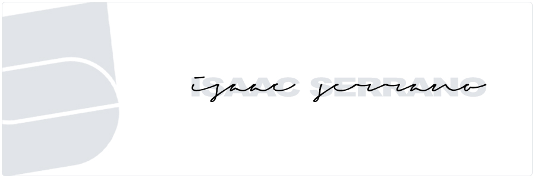

  

 

I'm a software engineer student and a very pasionated person in any kind of projects or problems that I see or make, I have interest in web development, GNU/Linux and Java/Kotlin.

-  Worked with CSS, HTML, Javascript 
-  Currently learning about Advanced Java and all about Open source community and git.
-  Mostly active in the OpenSource, Web Development Community and Reddit like [/r/UnixPorn](http://reddit.com/r/Unixporn)

